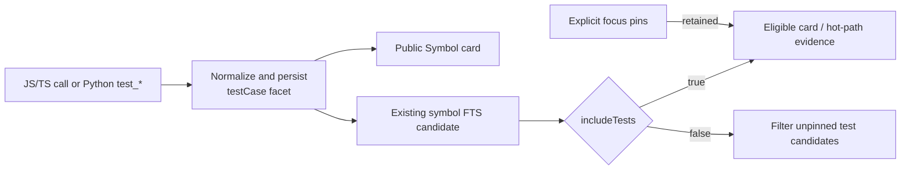

# Agent Context

`sdl.context` retrieves task-shaped code evidence from one shared retrieval and graph-expansion pipeline. It returns deterministic evidence instead of synthesized prose, so callers can inspect the selected cards, skeletons, hot paths, and relationships directly.

## When To Use It

Use `sdl.context` for explain, debug, review, and implementation tasks that need more than one exact lookup. Use `sdl.retrieve` when one symbol card, slice, skeleton, hot path, or bounded code window is enough.

Document-heavy planning should start with targeted `sdl.file` reads. Repository plans, ADRs, configuration, and templates are not indexed source evidence.

## Request Contract

The input is flat and strict. Unknown root keys and unknown `budget` keys are rejected.

| Field | Required | Purpose |
| --- | --- | --- |
| `repoId` | yes | Registered repository ID |
| `taskType` | yes | `debug`, `review`, `implement`, or `explain` |
| `taskText` | yes | Task description, up to 2,000 characters |
| `budget.maxTokens` | yes | Maximum tokens for the complete canonical payload |
| `focusPaths` | no | Repository-relative paths to prioritize |
| `focusSymbols` | no | Symbol IDs or names to prioritize |
| `chatMentions` | no | Identifiers explicitly named by the caller |
| `includeTests` | no | Override the selected task profile's test preference |
| `ifNoneMatch` | no | Return `notModified` when the canonical payload is unchanged |
| `responseMode` | no | `inline`, `auto`, or `handle` |
| `refsMode` | no | `auto` or `off` |
| `wireFormat` | no | `json`, `packed`, or `auto` |

Focus fields are authoritative priorities, not output boundaries. An exact indexed or overlay file in `focusPaths` can add its symbols to the existing bounded Tier-0 allocation. A directory is soft scope: after fusion bounds the candidate pool, it stable-partitions that pool without changing scores or provenance. Existing Tier-0 pins remain first, followed by unpinned in-directory rows in fused order, then remaining rows in fused order. Directory scope does not widen lanes, oversample, or rerun retrieval. Missing and tombstoned paths have no effect.

Semantic test cases remain ordinary symbols with an optional `testCase` card facet containing a framework, title, and optional suite path, category, and modifiers. JavaScript and TypeScript detectors cover `node:test`, Jest, and Vitest; Python detectors cover pytest and unittest. Python `test_*` functions and methods attach the facet to their existing structural symbols and retain their IDs. Every statically titled JavaScript or TypeScript `node:test`, Jest, or Vitest call instead emits a synthetic ordinary `function` symbol that covers the complete call construct, including calls with named callbacks. Other language detectors remain independent future additions.



The facet adds normalized test titles, suite names, frameworks, categories, and modifiers to the existing symbol FTS text and supplies evidence through the existing card and hot-path rungs. It does not create a test-only lane or query-time source scan. A valid facet makes a symbol a test candidate even outside a test-like path, so `includeTests: false` filters unpinned candidates while explicit focus pins remain eligible; `includeTests: true` admits them. Directory focus and dotted literals such as `sdl.info` retain their existing behavior: directory scope only stable-partitions the bounded fused pool, and a dotted literal centers a hot path only after symbol selection.

```json
{
  "repoId": "my-repo",
  "taskType": "debug",
  "taskText": "Find why parseConfig rejects valid timeout values",
  "budget": { "maxTokens": 4000 },
  "focusPaths": ["src/config/parse.ts"],
  "chatMentions": ["parseConfig"],
  "includeTests": true,
  "responseMode": "auto",
  "refsMode": "auto",
  "wireFormat": "auto"
}
```

## Retrieval Pipeline

Each request follows one deterministic pipeline:

1. The graph-read availability gate verifies that the current persisted graph is readable.
2. The task profile selects expansion direction, depth, preferred rungs, and the default test policy.
3. The shared candidate core resolves exact and focus seeds, then runs the available FTS, vector, file-summary, graph, overlay, feedback, and memory lanes.
4. Weighted reciprocal-rank fusion collapses vector models by source kind, keeps Tier-0 candidates first, and breaks ties by symbol ID.
5. The slice beam-search engine expands the selected graph frontier.
6. The selector admits complete non-exact Tier-1 bundles by rank and compares value per estimated token for progressive rung upgrades.
7. Hydration loads only selected bundles and evicts optional Tier-1 work if exact serialized size exceeds the budget.

The response reports one retrieval level:

- `hybrid`: lexical and vector lanes contribute with full configured coverage.
- `hybrid-partial`: at least one vector lane contributes with partial coverage.
- `lexical`: lexical lanes contribute without vector evidence.
- `graph-only`: resolved graph seeds are available without text or vector candidates.

Insufficient retrieval is an error, not a successful empty result.

## Response Contract

A successful canonical payload contains:

```json
{
  "status": "complete",
  "taskType": "debug",
  "retrieval": {
    "level": "hybrid",
    "lanes": [
      { "id": "exactIdentifier", "available": true },
      { "id": "symbolFts", "available": true },
      { "id": "symbolVec", "available": true, "coveragePermille": 1000 }
    ]
  },
  "evidence": [
    {
      "rung": "card",
      "symbolId": "src/config/parse.ts::parseConfig",
      "path": "src/config/parse.ts",
      "rank": 1,
      "tier": 0,
      "lanes": ["exactIdentifier", "symbolFts"],
      "content": {}
    }
  ],
  "edges": [],
  "omitted": {
    "total": 0,
    "byReason": { "budget": 0 },
    "highestRanked": []
  },
  "nextActions": [],
  "etag": "..."
}
```

`status` has three successful values:

- `complete`: all selected evidence fits.
- `budgetLimited`: resolved priority work exceeds the budget. Tier-1 evidence is suppressed, and `omitted.highestRanked` identifies bounded recovery work.
- `empty`: healthy available lanes ran and found no candidates.

Evidence rungs stop at `card`, `skeleton`, and `hotPath`. Raw code windows remain behind `sdl.retrieve` `codeNeedWindow`, where proof-of-need policy applies.

## Determinism And Wrappers

SDL-MCP computes the ETag from the complete canonical payload before applying session refs, packed wire encoding, or generic response-artifact wrapping. Repeated inline JSON and packed responses with `refsMode: "off"` are byte-stable against an unchanged graph, including populated semantic test-case facets.

`responseMode: "auto"` or `"handle"` can return a generic `response.get` artifact containing the complete canonical payload. The context engine does not create its own continuation or describe only a trimmed first page.

Session refs can replace repeated evidence content with stable references within one session. Set `refsMode: "off"` when byte identity or full content is required.

## Errors

An unreadable or unverified graph fails through the graph-retrieval availability gate. When every usable retrieval capability is insufficient, the handler returns `isError: true` with a deterministic recovery action.

A budget below the canonical envelope minimum returns `CONTEXT_BUDGET_TOO_SMALL` with `minimumTokens`. Unknown request fields fail strict schema validation.

## Related Surfaces

- `sdl.symbol.search` and `sdl.symbol.getCard` handle exact symbol lookup.
- `sdl.slice.build` retains stack-trace, failing-test, edited-file, and explicit-entry seed sources.
- `sdl.retrieve` exposes one-hop cards, slices, skeletons, hot paths, and gated code windows.
- `sdl.workflow` handles multi-step pipelines, runtime execution, transforms, and mutations.
- `sdl.response.get` retrieves generic large-response artifacts.

## Key Files

- `src/mcp/tools.ts`: public request and response schemas
- `src/mcp/tools/context.ts`: validation, graph admission, ETag, refs, wire format, and response artifacts
- `src/context/engine.ts`: v2 orchestration
- `src/context/profiles.ts`: task profiles
- `src/context/select.ts`: deterministic rank-first bundle admission and value-per-token rung selection
- `src/context/hydrate.ts`: selected-only evidence hydration
- `src/context/serialize.ts`: canonical stable serialization
- `src/retrieval/context-candidate-search.ts`: shared candidate collection and fusion
- `src/graph/slice/beam-search-engine.ts`: graph expansion

## Related

- [Context Profiles](./context-modes.md)
- [Code Mode](./code-mode.md)
- [Token Economy](./token-economy.md)
- [MCP Tools Reference](../mcp-tools-reference.md)
