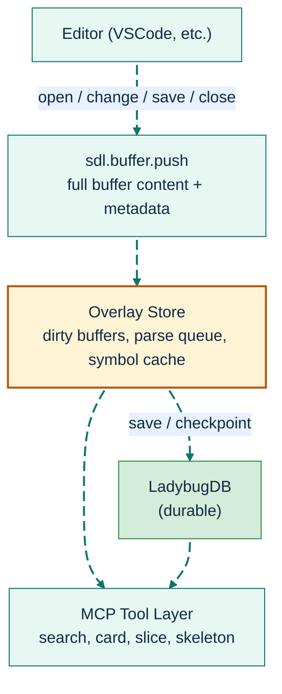
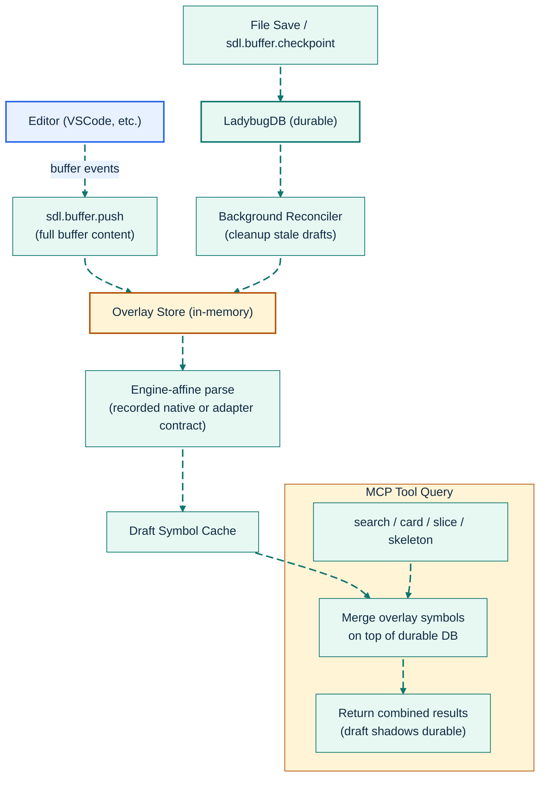

# Live Indexing: Real-Time Code Intelligence

[Back to README](../../README.md)

---

## The Stale Context Problem

Traditional code indexing is a batch operation: you index once, then the database is stale until you index again. For an AI agent helping you write code, this means the symbols it sees are always one step behind your edits.

SDL-MCP's live indexing system eliminates this gap. As you type in your editor, SDL-MCP receives buffer updates, parses them in the background, and overlays the new symbols on top of the durable database. Search, cards, and slices reflect your *current* code, not your last save.

---

## Architecture



### Overlay Merge and Checkpoint Flow



### How It Works

1. **Buffer Push**: Your editor extension sends the full file content on every keystroke (debounced) via `sdl.buffer.push`.
2. **Background Parse**: The overlay store queues a parse with the durable file's recorded contract, or selects one after provenance preflight for a genuinely new file.
3. **Overlay Merge**: When any tool queries the database (search, getCard, slice.build), the overlay symbols are merged on top of the durable DB results. Draft symbols shadow their durable counterparts.
4. **Checkpoint**: On file save or manual checkpoint (`sdl.buffer.checkpoint`), SDL-MCP reconciles the overlay through the owned graph-integrity revision.
5. **Reconciliation**: A background reconciler ensures overlay and durable state converge, cleaning up stale drafts.

### Engine Affinity and Recovery

Full indexing stores one `FileParserState` for each indexed file and one exact `RepoParserState` coverage record for the verified graph version and revision. Existing files always reuse that recorded engine, engine contract, adapter key, and language. A genuinely new file selects a contract only after repository provenance preflight succeeds.

The native engine parses live content through the in-memory `parseContent` capability and the `native:1` identity contract. SDL-MCP never falls back from a recorded native contract to TypeScript, or between plugin adapters, because that could change symbol IDs, AST fingerprints, and ranges. Contract-bearing plugins identify live parsing with the plugin name, package version, adapter identity, and adapter contract version.

Saved-file reconciliation atomically commits file, symbol, edge, parser-provenance, manifest, and revision changes in one foreground transaction. A separate background transaction publishes complete parser coverage and `graphIntegrityState: "verified"` together only after exact coverage and graph checks pass. Missing provenance, unavailable engines, contract mismatches, remap ambiguity, or phase failures stop the mutation; preserve the database and run a stopped `index --force --safe-rebuild <absolute-new-path>` for pre-provenance or failed graphs.

### What Gets Overlaid

| Tool | Overlay Behavior |
|:-----|:-----------------|
| `sdl.symbol.search` | Draft symbols appear in results alongside durable symbols |
| `sdl.symbol.getCard` | Returns draft symbol card if the file has unsaved changes |
| `sdl.slice.build` | Includes draft symbols in the BFS traversal |
| `sdl.code.getSkeleton` | Generates skeleton from draft content |
| `sdl.code.getHotPath` | Searches draft content for identifiers |

---

## Configuration

```jsonc
{
  "liveIndex": {
    "enabled": true,          // master switch
    "debounceMs": 75,         // debounce between buffer events (25-5000, default: 75)
    "idleCheckpointMs": 15000,// auto-checkpoint after idle period (default: 15s)
    "maxDraftFiles": 200,     // max concurrent draft files (default: 200)
    "reconcileConcurrency": 1,// concurrent overlay→DB merge jobs (1-8)
    "clusterRefreshThreshold": 25 // reconciled symbols before cluster refresh
  }
}
```

### Status Monitoring

`sdl.repo.status` includes a `liveIndexStatus` section:

```json
{
  "liveIndexStatus": {
    "enabled": true,
    "pendingBuffers": 2,
    "dirtyBuffers": 1,
    "parseQueueDepth": 0,
    "checkpointPending": false,
    "lastCheckpointResult": "success"
  }
}
```

For deeper diagnostics, use `sdl.buffer.status`.

---

## Related Tools

- [`sdl.buffer.push`](../mcp-tools-detailed.md#sdlbufferpush) - Push editor buffer events
- [`sdl.buffer.checkpoint`](../mcp-tools-detailed.md#sdlbuffercheckpoint) - Force a checkpoint
- [`sdl.buffer.status`](../mcp-tools-detailed.md#sdlbufferstatus) - Live indexing diagnostics
- [`sdl.repo.status`](../mcp-tools-detailed.md#sdlrepostatus) - Includes live index health

[Back to README](../../README.md)
